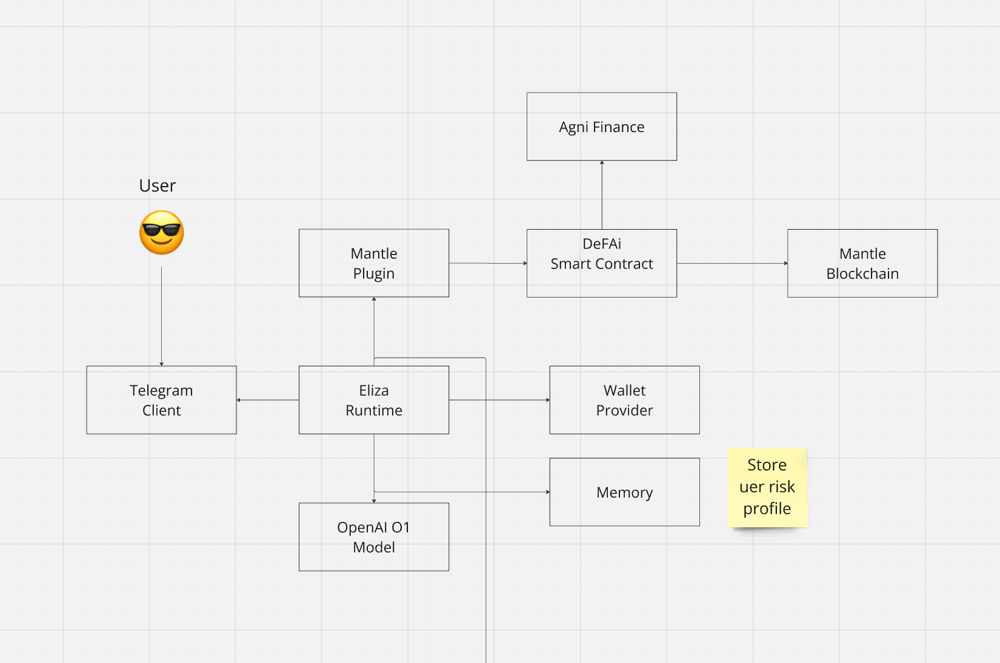

# TG DEFAI Agent

## Duplicate the .env.example template

```bash
cp .env.example .env
```

\* Fill out the .env file with your own values.

### Add login credentials and keys to .env
```
OPENAI_API_KEY="discord-application-id"
EVM_PRIVATE_KEY="discord-api-token"
EVM_PROVIDER_URL="username"
TELEGRAM_BOT_TOKEN="password"
DEFAI_CONTRACT="your@email.com"
```

## Install dependencies and start your agent

```bash
pnpm i 
pnpm buid:packages
pnpm start
```
Note: this requires node to be at least version 22 when you install packages and run the agent.

## Deploy the contract

```bash
npx hardhat run hardhat/scripts/deploy.ts
```

**How to test**
```
input: swap 0.0001 usdc to mnt
```


**Problems in Current DeFi Ecosystems**
1. Fragmented User Experience
Users often navigate between multiple platforms for staking, lending, liquidity provision, and yield farming, leading to inefficiency.

2. Lack of Personalized Financial Management
Most DeFi platforms provide generic financial services, lacking tailored solutions or strategies for individual users.

3. Inefficient Liquidity Management
Users struggle to maximize liquidity utilization across multiple protocols, often leaving capital underutilized.

4. Barriers for New Users
Complex interfaces, jargon-heavy processes, and lack of guidance deter new entrants from engaging in DeFi.

5. Market Volatility and Risk Management
Users lack tools to monitor risk exposure dynamically and rebalance their portfolios during volatile market conditions.

**Solution**
A smart, personalized AI-driven financial assistant integrated with Mantle DeFi protocols. This agent offers users seamless, automated, and strategic DeFi interactions.


## How it works
